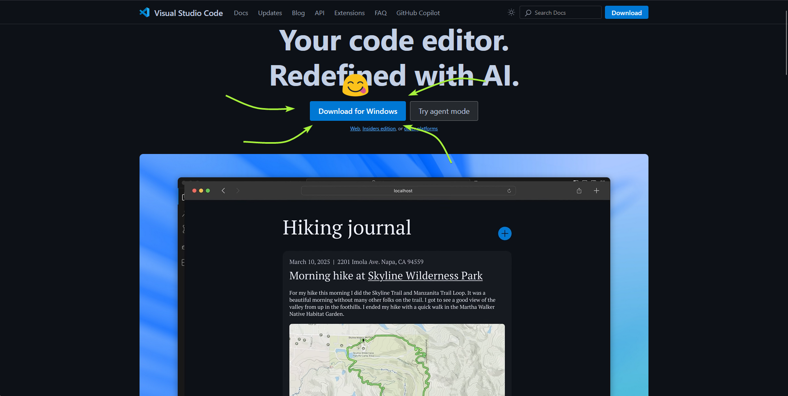
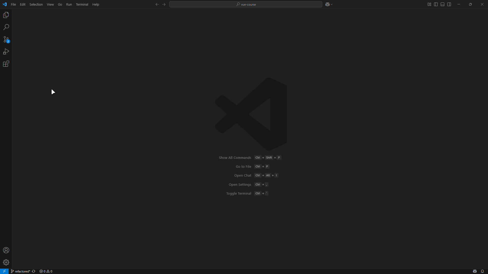
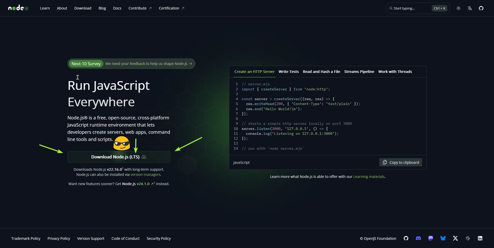
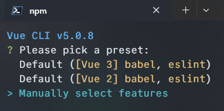
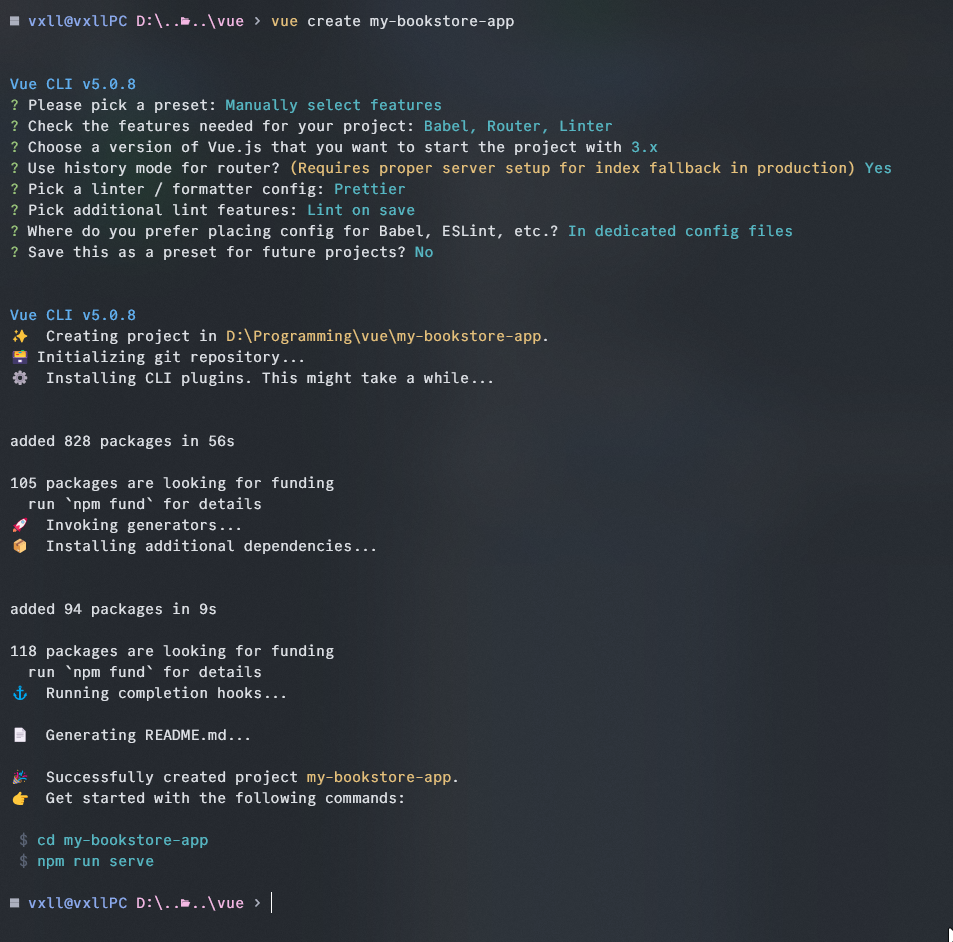
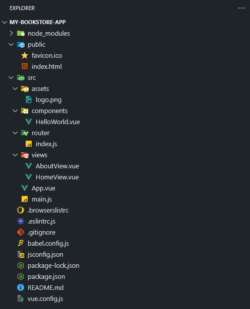
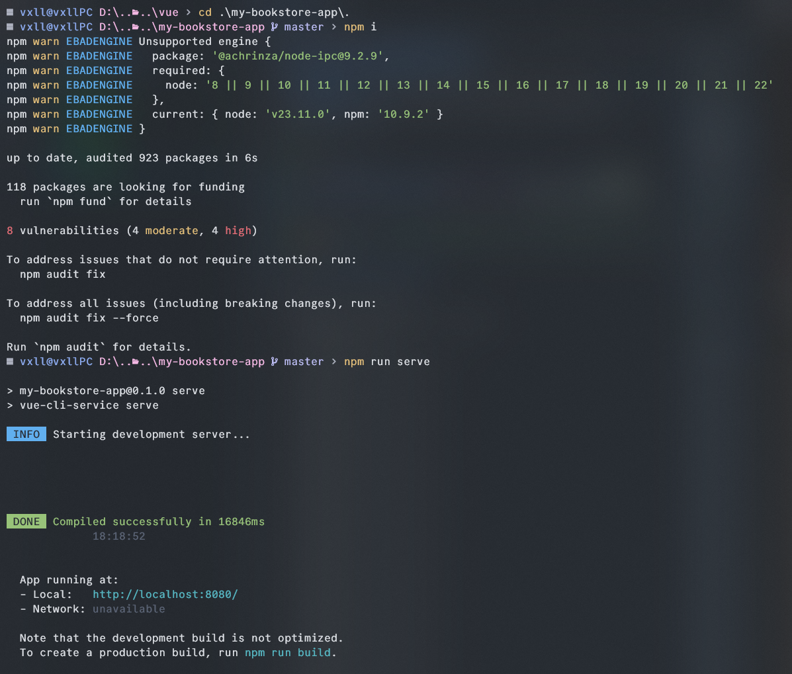
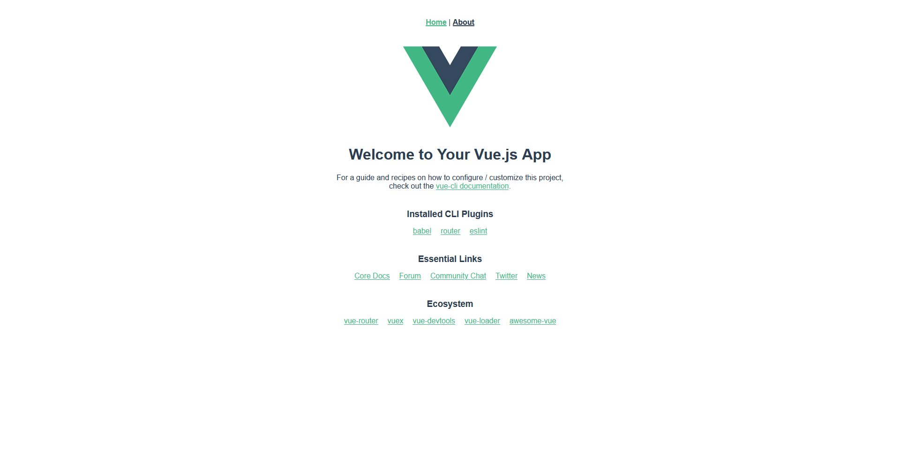

# Тема 00: 🚀 Подготовка рабочей среды

> <p align=center>Привет, будущий Vue-разработчик! 👋</p>

Прежде чем мы погрузимся в увлекательный мир Vue.js и начнем создавать наш интерактивный каталог книг, нам нужно подготовить наши инструменты и рабочее место. Эта "нулевая" тема поможет тебе настроить всё необходимое. 

😊 Не волнуйся, я проведу тебя через каждый шаг!

<br>

## 🛠️ IDE - Твой главный инструмент

**IDE**, или **Интегрированная Среда Разработки**, — это программа, где ты будешь писать код. 

Хороший редактор кода может значительно облегчить жизнь разработчика, предлагая подсветку синтаксиса, автодополнение, отладку и многое другое.

### ⭐ Популярные варианты IDE для веб-разработки:

| IDE                   | Стоимость          | Ключевые особенности                                      | Рекомендация для Vue |
|-----------------------|--------------------|-----------------------------------------------------------|----------------------|
| Visual Studio Code    | Бесплатно          | Огромное сообщество, расширения, легкий, быстрый           | ⭐ **Рекомендуемый** |
| WebStorm              | Платно (студ. 🆓)  | Мощные инструменты для JS/TS, рефакторинг, отладка          | Отлично              |
| Sublime Text          | Платно (пробн. 🆓) | Очень быстрый, минималистичный, расширяемый             | Хорошо               |
| Atom                  | Бесплатно          | Открытый исходный код, пакеты (развитие замедлилось)      | Нормально            |

> **💡 Почему VS Code?**
>
> **VS Code** предлагает отличный баланс между функциональностью, производительностью и доступностью. Он бесплатен, имеет открытый исходный код и поддерживается Microsoft. Огромное сообщество создает полезные расширения для любых нужд.
    
<br>

### 🔧 Настройка VS Code для Vue.js:

#### **1. Скачай и установи VS Code:**
- Перейди на официальный сайт: [Здесь](https://code.visualstudio.com/)
- Скачай версию для своей операционной системы (Windows, macOS, Linux).
- Следуй инструкциям установщика. Это довольно просто!



#### **2. Установи рекомендуемые расширения:**
Расширения добавляют в VS Code новую функциональность. Чтобы установить расширение:
- Открой VS Code.
- На боковой панели слева нажми на иконку "Расширения" (выглядит как несколько квадратиков 🧩).
- В строке поиска введи название расширения и нажми "Установить".



##### 📃 Вот список маст-хэв расширений для Vue-разработки:

* **Vue Language Features (Volar)**: Официальное и основное расширение для поддержки Vue.js 3. Обеспечивает подсветку синтаксиса, проверку ошибок, автодополнение для файлов `.vue`.
    > ⚠️ **Важно:** Если вы ранее работали с Vue 2 и использовали расширение `Vetur`, для Vue 3 рекомендуется именно `Volar`. Они могут конфликтовать, поэтому убедитесь, что `Vetur` отключен или удален, если вы работаете над Vue 3 проектом с `Volar`.
    * Ссылка: [Vue Language Features (Volar) в Marketplace](https://marketplace.visualstudio.com/items?itemName=Vue.volar) 
    <br>
* **ESLint**: Интегрирует ESLint в VS Code. ESLint — это инструмент для статического анализа кода, который помогает находить ошибки и поддерживать единый стиль кода.
    * Ссылка: [ESLint в Marketplace](https://marketplace.visualstudio.com/items?itemName=dbaeumer.vscode-eslint)
    <br>
* **Prettier - Code formatter**: Автоматически форматирует ваш код, чтобы он выглядел аккуратно и соответствовал стандартам.
    * Ссылка: [Prettier - Code formatter в Marketplace](https://marketplace.visualstudio.com/items?itemName=esbenp.prettier-vscode)
    <br>

* **Path Intellisense**: Помогает с автодополнением путей к файлам. Очень удобно!
    * Ссылка: [Path Intellisense в Marketplace](https://marketplace.visualstudio.com/items?itemName=christian-kohler.path-intellisense)


### **3. Познакомься с интегрированным терминалом:**
VS Code имеет встроенный терминал (`View > Terminal`). Это очень удобно – не нужно переключаться между окнами для выполнения команд.

<br>

## 🏗️ Node.js и npm - Основа основ

### Что такое Node.js?
**Node.js** — это среда выполнения **JavaScript**, построенная на движке Chrome V8. Проще говоря, Node.js позволяет выполнять JavaScript-код **вне браузера**.

### Что такое npm?
npm (Node Package Manager) — это менеджер пакетов для Node.js, устанавливается автоматически вместе с Node.js. Он нужен для установки библиотек, фреймворков и инструментов командной строки.

> 
> <p align=center style='font-weight: bold; display:flex;justify-content:center;align-items:center;gap:5px; margin-top:'> 
> 
> npm <span style="color:#CD5C5C"> VS </span> yarn 
> 
> </p1> 
> 
> Ты можешь встретить упоминание **yarn** – это альтернативный менеджер пакетов. Оба хороши. В этой методичке мы будем использовать **npm**, так как он идет "из коробки" с Node.js.

### Установка Node.js и npm:

-  **Перейди на официальный сайт Node.js:** **[Здесь](https://nodejs.org/)**
-  **Скачай LTS-версию.**
    > **💡 Совет:** LTS (Long-Term Support) означает "долгосрочная поддержка" – это самая стабильная версия, рекомендуемая для большинства пользователей и проектов.
-  **Установи Node.js**, следуя инструкциям инсталлятора.
-  **Проверь установку:** Открой терминал и выполни команды:
    ``` Bash
    node -v
    npm -v
    ```
    > ❗ Если все ок, ты увидишь версии, например: `v20.11.0` и `10.2.4` (твои версии могут отличаться).



<br>

## 🚀 Vue CLI - Твой помощник для проектов Vue

### Что такое Vue CLI? 🤔
**Vue CLI** (**Command Line Interface**) — это официальный инструмент для быстрой разработки приложений на Vue.js. Он автоматизирует многие рутинные задачи.

**Зачем он нужен?**
* 🤖 Генерация проекта с готовой структурой.
* ⚙️ Настройка сборки и оптимизации.
* 🖥️ Встроенный сервер для разработки с горячей перезагрузкой (Hot Module Replacement - HMR).
* 🔌 Управление плагинами.

### Установка Vue CLI:

1.  Открой терминал и выполни команду:
    ``` Bash
    npm install -g @vue/cli
    ```
    > ❗ Ключ `-g` устанавливает пакет глобально.

2.  **Проверь установку:**
    ``` Bash
    vue --version
    ```
    > Ты должен увидеть версию, например: `@vue/cli 5.0.8`.

<br>

## 🎉 Создание твоего первого Vue-проекта

### Настало время создать скелет нашего "Книжного магазина"!

1.  **Создай проект в VScode**
2.  **Открой терминал** `view > terminal`
3.  **Создай проект:**
    ``` Bash
    vue create my-bookstore-app
    ```
    > ❗ Ты можешь выбрать другое имя, например, `vue-bookstore`.

4.  **Выбери пресет (настройки проекта):**
    <div align=center> 
     
    </div>

    > ❗ Рекомендую выбрать **"Manually select features"** (Выбрать функции вручную).

    <details style="cursor:pointer"> 
    <summary>Отметь галочками (пробелом) нужные опции и нажми Enter:</summary>

    * `Choose Vue version` ➡️ **Vue 3**
    * `Babel` ➡️ **Да**
    * `Router` ➡️ **Да** (включи history mode, если спросит)
    * `Pinia` ➡️ **Да** (современный менеджер состояний для Vue)
    * `Linter / Formatter` ➡️ **Да**
        * Выбери `ESLint + Prettier`.
        * Выбери `Lint on save`.
    
    <br> 

    * **Размещение конфигурации:** 
        * "Where do you prefer placing config...?" ➡️ **"In dedicated config files"**.
    *  **Сохранить пресет?** 
        * "Save this as a preset...?" ➡️ `N` (Нет), если не хочешь.
    </details>
    <br>
    <div> 

    > Терпеливо дождись окончания установки. ☕

    
    </div>
    
    > 🖼️ Итог на картинке


### Структура сгенерированного проекта:

Когда всё будет готово, Vue CLI создаст папку `my-bookstore-app`. Давай заглянем внутрь!

<details style="cursor:pointer">
<summary>🔍 Нажмите, чтобы увидеть детальный обзор структуры проекта</summary>

* **`node_modules/`**: Хранилище всех установленных пакетов. В Git не добавляется.
* **`public/`**: Статические активы. `index.html` – главный HTML-файл.
* **`src/`**: 💖 **Твой исходный код!**
    * `assets/`: Локальные статические ресурсы (картинки, шрифты).
    * `components/`: Переиспользуемые Vue-компоненты (кусочки интерфейса).
    * `router/`: Конфигурация Vue Router (маршруты страниц).
    * `store/`: Хранилища Pinia (управление состоянием приложения).
    * `views/`: Компоненты-страницы.
    * `App.vue`: Корневой компонент приложения.
    * `main.js`: Точка входа. Инициализация Vue и плагинов.
* **`.gitignore`**: Файл для Git, указывающий, какие файлы и папки игнорировать.
* **`babel.config.js`**: Конфигурация Babel.
* **`jsconfig.json` или `tsconfig.json`**: Помогает VS Code лучше понимать проект.
* **`package.json`**: "Паспорт" проекта: зависимости, скрипты (`npm run serve`, `npm run build`).
* **`package-lock.json`**: Фиксирует точные версии зависимостей для консистентности сборок.

</details>

<div align=center> 

</div>

> <p align=center> Не пугайся обилия файлов! Мы со всем разберемся по ходу дела. 😉 </p>

<br>

## 🏎️ Запуск проекта и проверка

1.  **Перейди в папку проекта** в терминале:
    ```bash
    cd my-bookstore-app
    ```
2.  **Установи зависимости**
    ``` Bash
    npm i
    ```
3.  **Запусти сервер разработки:**
    ```bash
    npm run serve
    ```
    Ты увидишь что-то вроде:
    ```
    App running at:
    - Local:   http://localhost:8080/
    ```
<div align=center> 

</div>

> Открой `http://localhost:8080` в браузере. Ты должен увидеть стартовую страницу Vue! 🥳🎉🎊🪅💃

<div align=center> 

</div>

<br>

## 🧐 Самостоятельная работа и проверка

Теперь немного практики для закрепления:

* [ ] Убедись, что команды `node -v`, `npm -v` и `vue --version` в твоем терминале выводят корректные версии.
* [ ] (Опционально, для любознательных 🧠) Попробуй создать еще один тестовый Vue-проект (`vue create test-project-experiment`), но на этот раз выбери другие опции при настройке (например, без Router или Pinia, или добавь TypeScript). Это поможет тебе лучше понять процесс. Потом этот проект можно удалить.
* [ ] Открой папку `my-bookstore-app` в VS Code.
* [ ] Найди и открой файл `src/App.vue`.
* [ ] Внутри тега `<template>` измени приветственное сообщение на что-то свое (например, "Добро пожаловать в мой книжный магазин!").
* [ ] Сохрани файл (`Ctrl+S` или `Cmd+S`).
* [ ] Посмотри на страницу в браузере. Изменения должны были отобразиться автоматически! Это магия Hot Module Replacement (HMR). 🔥

**Мини-вопросы для самоконтроля:**
* Какую команду ты используешь для создания нового Vue-проекта с помощью Vue CLI? (`vue create <имя-проекта>`)
* Какую команду ты используешь для запуска сервера разработки? (`npm run serve`)

## 🔗 Полезные ссылки

* **Node.js (Официальный сайт):** [https://nodejs.org/](https://nodejs.org/)
* **Vue CLI (Документация):** [https://cli.vuejs.org/](https://cli.vuejs.org/)
* **Visual Studio Code (Официальный сайт):** [https://code.visualstudio.com/](https://code.visualstudio.com/)
* **Vue Language Features (Volar) (Расширение VS Code):** [https://marketplace.visualstudio.com/items?itemName=Vue.volar](https://marketplace.visualstudio.com/items?itemName=Vue.volar)
* **Pinia (Документация):** [https://pinia.vuejs.org/](https://pinia.vuejs.org/)
* **Vue Router (Документация):** [https://router.vuejs.org/](https://router.vuejs.org/)

> ✨ **Поздравляю!** Ты успешно подготовил(а) свою рабочую среду. Теперь мы готовы перейти к изучению самого Vue.js в следующей теме!

---


<div align=center style="display:flex;justify-content:center;"> 

**[⬅️ Назад](../00-environment/) | [Вперед ➡️](../00-environment/)** 

</div>