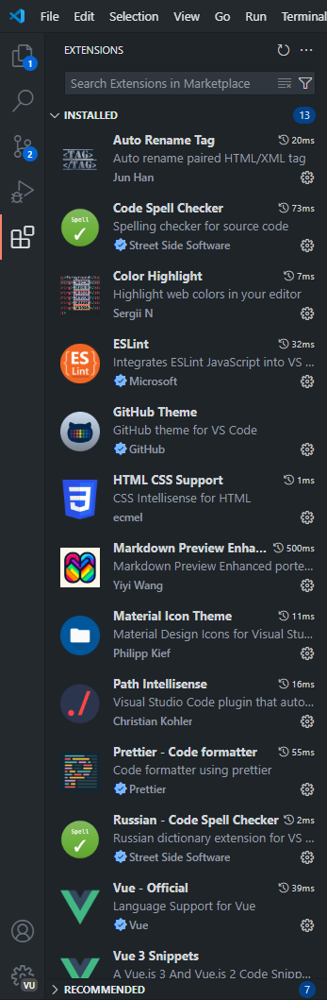
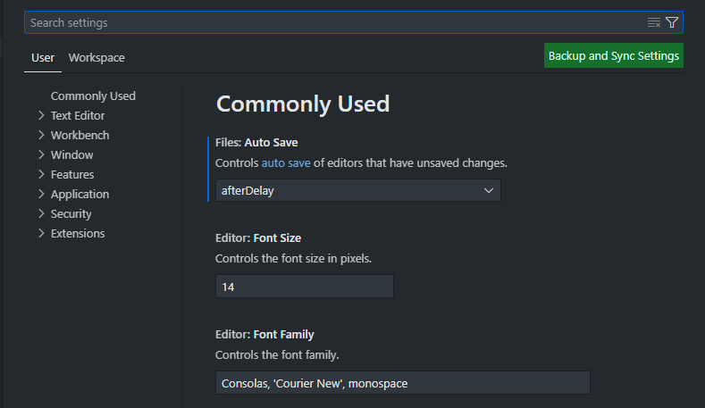
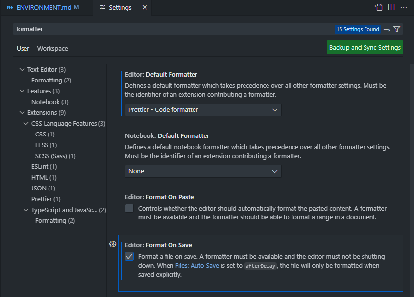

<h1 id=start align=center>🌐Окружение</h1>

<br>

## ✅Проверка 

💻 **Перед началом работы нам нужно проверить, что все необходимое установлено**
``` PowerShell
node -v
# v23.11.0 <- вывод

npm -v
# 10.9.2  <- вывод

vue --version
# @vue/cli 5.0.8 <- вывод
```
> ❗У тебя версия может отличаться

Если вывод консоли сходится с этим 👆 то [переходите дальше](../01-intro/THEORY.md) 

Если же у вас появилась ошибка - 👇смотрите туда

---
<br>


## 🧩Node.js и 🏗️npm

<p align=center>
    
    
</p>

- **Node.js** - среда выполнения JavaScript вне браузера
- **npm** - менеджер пакетов

> ❗Эти инструменты - одни из важнейших в веб разработке

### 📨Установка
1. Перейди на офф. сайт - [👉Жми сюда](https://nodejs.org)
2. Скачай и установи
3. Проверь установку в PowerShell 👇
``` PowerShell
node -v
npm -v
```


---
<br>


## ⚡Vue CLI

<p align=center>  </p>
 

- **Vue CLI** - официальный инструмент для быстрого старта проекта

### 📨Установка
1. Напиши это в PowerShell 👇
``` PowerShell
npm install -g @vue/cli
```

2. Проверь установку
``` PowerShell
vue --version
```


---
<br>


## 💻IDE

<p align=center>
    
    
</p>

- Надеюсь пояснять что такое IDE не нужно, но вам нужно определиться в каком писать.

### 👇Выберите из этих
- [Visual Studio Code](https://code.visualstudio.com/) - Этот лучший
- [JetBrains WebStorm](https://www.jetbrains.com/webstorm/)
- [Notepad](https://apps.microsoft.com/detail/9msmlrh6lzf3?hl=en-US&gl=US)

---
<br>

## 🔧Настройка VSCode
**Если лень делать самому можете скачать 👇**
- [Отсюда](https://github.com/GeorgeBlackbird/vsc-settings)
- [Или отсюда]

<br>

### 👷Расширения `Ctrl+Shift+x`
- Path Intellisense
- ESLint
- Prettier
- HTML CSS Support
- Auto Rename Tag
- Color Highligt
- Vue - Official
- Vue 3 snippets
- Code Spell checker
- Markdown Preview Enhanced

> ❗это все не обязательно, но с этим будет в разы проще

<br>

### 💎Темы `Ctrl+Shift+x`
- Material icon theme
- Github Theme
- Gruvbox Theme

> ❗Можете сами полистать и поискать то, что понравится вам

<br>

<h4 align=center> Вот что получилось у меня </h4>

<p align=center>  </p>

<br>

### Настройки `Ctrl+,`

**Включи автосохранение `Auto Save` и настрой шрифты `Font`**


<br>

Включи **Prettier** и **Форматирование** при сохранении


> ❗Главное, чтобы тебе было удобно, можешь полистать настройки и сделать так, как нравиться тебе (например настроить плавный курсор)


## 🏁Итог

В этой теме ты настроил свое рабочее место для дальнейшей работы с `Vue`, эти настройки - **минимум**, который позволит тебе работать не отвлекаясь на мелкие детали, но **не стесняйся настраивать** свое место так, как удобно тебе, а пока переходи к следующей теме 👇

**Введение во Vue и Веб разработку** [Жми](../01-intro/THEORY.md)