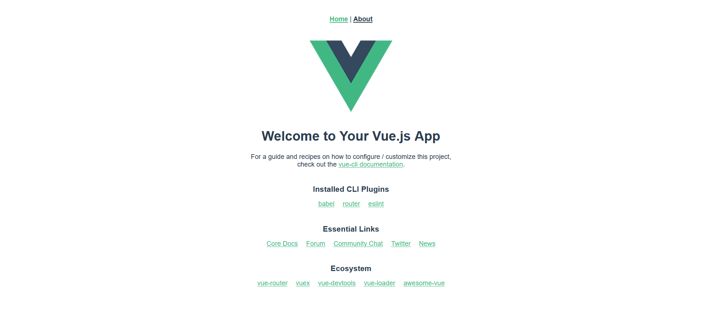
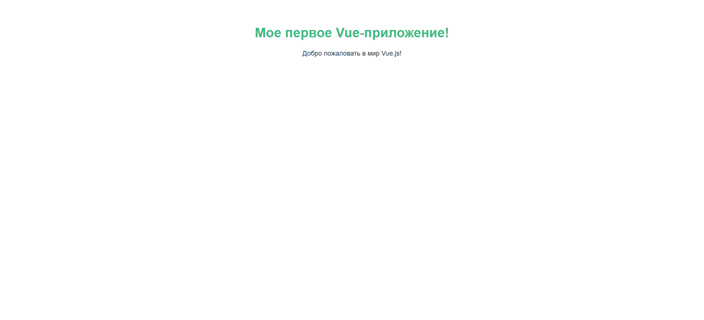

# Тема 01: 💻 "Привет, Vue!"
> <p align=center> 🛠️ Практика </p>

В теоретической части мы познакомились с основами Vue.js. Теперь давай применим эти знания на практике и создадим наше первое маленькое Vue-приложение!

<br>

## 🎯 Цель практики:

1.  Очистить компонент `App.vue` от демонстрационного содержимого.
2.  Добавить в компонент `App.vue` собственные данные (например, название нашего будущего магазина и приветствие).
3.  Отобразить эти динамические данные на странице с помощью синтаксиса интерполяции `{{ }}`.

<br>

## 🛠️ Подготовка:

1.  Убедись, что твой проект, созданный в **Теме 00** (например, `my-bookstore-app`), открыт в VS Code.
2.  Запусти сервер для разработки, если он еще не запущен. Открой терминал в VS Code и выполни команду:
    ```bash
    npm run serve
    ```
3.  Открой в браузере страницу твоего приложения (обычно `http://localhost:8080/`). Ты должен видеть стандартную приветственную страницу Vue.

<div align=center> 

</div>

<br>

## 🚀 Шаги выполнения:

### Шаг 1: Откройте файл `App.vue`

Найди и открой файл `App.vue` в твоем проекте. Он находится в папке `src/App.vue`. Этот файл является корневым компонентом твоего приложения.

### Шаг 2: Очистим `App.vue` для нашего примера

Сейчас файл `App.vue` содержит код для демонстрационной страницы Vue. Чтобы начать с чистого листа и лучше понять основы, мы его немного изменим.

**Текущее (или примерное) содержимое `App.vue` может выглядеть так:**

``` html
<template>
  
  <HelloWorld msg="Welcome to Your Vue.js App"/>
</template>

<script>
import HelloWorld from './components/HelloWorld.vue'

export default {
  name: 'App',
  components: {
    HelloWorld
  }
}
</script>

<style>
#app {
  font-family: Avenir, Helvetica, Arial, sans-serif;
  -webkit-font-smoothing: antialiased;
  -moz-osx-font-smoothing: grayscale;
  text-align: center;
  color: #2c3e50;
  margin-top: 60px;
}
</style>
```

**Замени всё содержимое файла `App.vue` на следующий код:**

``` html
<template>
  <div id="my-first-vue-app">
    <h1>{{ pageTitle }}</h1>
    <p>{{ greetingMessage }}</p>
  </div>
</template>

<script>
export default {
  name: 'App', // Имя компонента, хорошая практика его оставлять
  data() {
    // Функция data() должна возвращать объект.
    // Свойства этого объекта будут нашими реактивными данными.
    return {
      pageTitle: 'Мое первое Vue-приложение!',
      greetingMessage: 'Добро пожаловать в мир Vue.js!'
    };
  }
}
</script>

<style>
#my-first-vue-app {
  font-family: Avenir, Helvetica, Arial, sans-serif;
  -webkit-font-smoothing: antialiased;
  -moz-osx-font-smoothing: grayscale;
  text-align: center;
  color: #2c3e50;
  margin-top: 60px;
}

h1 {
  color: #42b983; /* Фирменный зеленый цвет Vue */
}
</style>
```

*Что мы сделали:*
* `<template>`: Удалили стандартную разметку и добавили простой `div` с `h1` и `p`. Обрати внимание на `{{ pageTitle }}` и `{{ greetingMessage }}` – это места, куда Vue вставит наши данные.
* `<script>`:
  * Мы оставили `export default { name: 'App', ... }`.
  * Самое важное здесь – это метод `data()`. Как мы обсуждали в теории, это функция, которая **возвращает объект**. Ключи этого объекта (`pageTitle`, `greetingMessage`) становятся реактивными данными компонента. Их значения (`'Мое первое Vue-приложение!'`, `'Добро пожаловать в мир Vue.js!'`) – это то, что мы хотим отобразить.
* `<style>`: Мы оставили некоторые базовые стили для центрирования и шрифта, но убрали лишнее. Ты можешь их изменять или добавлять свои.

### Шаг 3: Проверьте результат в браузере

Сохрани файл `App.vue` (`Ctrl+S` или `Cmd+S`).

Теперь посмотри на страницу в браузере (обычно `http://localhost:8080/`). Если сервер разработки (`npm run serve`) запущен, страница должна была автоматически обновиться (благодаря Hot Module Replacement!).

Ты должен увидеть что-то вроде этого:

<div align=center> 

</div>

**Поздравляю! 🎉 Ты только что отобразил динамические данные с помощью Vue!**

<br>

### Шаг 4: Эксперимент! 🧪

Теперь попробуй немного поэкспериментировать, чтобы лучше понять, как это работает:

1. **Добавь новое свойство:**
   * Внутри функции `data()`, в возвращаемый объект, добавь еще одно свойство. Например, название твоего будущего книжного магазина:

```js
// ... внутри data()
return {
  pageTitle: 'Мое первое Vue-приложение!',
  greetingMessage: 'Добро пожаловать в мир Vue.js!',
  storeName: 'Книжный Рай "Читай-Город"' // Твое новое свойство
};
// ...
```

  * Теперь отобрази это свойство в шаблоне `<template>`. Например, добавь еще один параграф:

```html
<p>Скоро здесь будет: {{ storeName }}</p>
```

  * Сохрани файл и посмотри на результат в браузере.
2. Измени существующие данные:
  * Поменяй значения свойств `pageTitle` или `greetingMessage` в функции `data()`.
  * Сохрани файл. Изменения должны мгновенно отразиться на странице.

Это и есть **реактивность** Vue в действии!

## 🤔 Что мы узнали?

* Как определить реактивные данные в компоненте Vue с помощью метода `data()`.
* Как отобразить эти данные в HTML-шаблоне, используя синтаксис интерполяции `{{ }}`.
* Увидели, как Vue автоматически обновляет страницу при изменении данных.

Это базовые, но очень важные концепции. На них будет строиться вся дальнейшая разработка на Vue.

В следующей части (`TASK.md`) тебя ждут небольшие задания для самостоятельной проверки и закрепления материала. Удачи!

---


<div align=center style="display:flex;justify-content:center;"> 

**[⬅️ Назад](./THEORY.md) | [Вперед ➡️](./TASK.md)** 

</div>