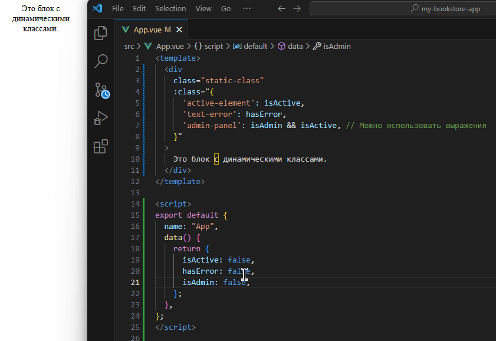

# Тема 02: 🎨 Директивы Vue: Привязка данных к атрибутам, классам и стилям
> <p align=center> 📑 Теория </p>

Привет! 👋 В предыдущей теме мы познакомились с основами Vue, включая интерполяцию `{{ }}` и общее понятие директив. Теперь мы углубимся в одну из самых часто используемых директив — `v-bind`, которая позволяет нам "оживлять" HTML-атрибуты, делая их динамическими!

**Что такое директивы (краткое напоминание)?**
Директивы — это специальные атрибуты с префиксом `v-`. Они говорят Vue выполнить определенные действия с DOM-элементом, к которому они применены.

<br>

## 🔗 Директива `v-bind`: Основа динамических атрибутов

Директива **`v-bind`** используется для динамического связывания одного или нескольких HTML-атрибутов (или входных параметров компонента, о чем мы поговорим позже) со значениями из нашего JavaScript-кода (обычно из объекта, возвращаемого функцией `data()`).

**Полный синтаксис:**
```html

```

### Сокращенный синтаксис (рекомендуемый и наиболее часто используемый):

Vue предоставляет удобное сокращение для `v-bind` — просто двоеточие (`:`):

```html

```

> 📗 В этой методичке мы будем использовать преимущественно сокращенный синтаксис, так как он более лаконичен.

В обоих случаях `imageSource` — это свойство из `data()`, значение которого Vue подставит в атрибут `src`. Если `imageSource` изменится, атрибут `src` на странице также автоматически обновится!

<br>

## ⚡ Динамическая привязка стандартных HTML-атрибутов

С помощью `v-bind` (или `:`) мы можем сделать практически любой HTML-атрибут динамическим.

### Привязка к `src` и `href`

Это классические примеры:
* **Динамический путь к изображению:**

  Допустим, в `data()` у нас есть свойство `bookCoverUrl`:

```js
// ... в data() компонента
data() {
  return {
    bookCoverUrl: '[https://example.com/covers/vue-for-beginners.jpg](https://example.com/covers/vue-for-beginners.jpg)',
    // ... другие данные
  };
}
```

  В шаблоне мы можем отобразить это изображение так:

```html

```

  Если значение `bookCoverUrl` изменится, Vue автоматически обновит атрибут `src` тега ``, и отобразится новое изображение.

* **Динамическая ссылка:**

  Аналогично для ссылок:

```js
// ... в data()
data() {
  return {
    productLink: '/products/amazing-vue-book'
    // ...
  };
}
```

```html
<a :href="productLink">Подробнее о книге</a>
```

### Привязка к другим атрибутам (`id`, `disabled`, `value` и т.д.)

Вы можете связывать любые атрибуты:

* **Динамический `id`:**

```html
<div :id="'section-' + sectionId">Содержимое секции</div>
```

  Здесь `'section-' + sectionId` — это JavaScript-выражение, результат которого станет значением `id`.

* **Условная блокировка кнопки (`disabled`):**

  Атрибут `disabled` является булевым. Vue обрабатывает его особым образом: если выражение истинно (`true`), атрибут добавляется; если ложно (`false`) — атрибут удаляется.

```js
// ... в data()
data() {
  return {
    isFormInvalid: true // Например, форма невалидна
    // ...
  };
}
```

```html
<button :disabled="isFormInvalid">Отправить</button>
```


  > 💡 Помните, что внутри кавычек атрибута `v-bind` (например, `:src="..."`) вы можете использовать любые валидные **однострочные JavaScript-выражения**. Vue вычислит это выражение и подставит результат.

<br>

## 🎨 Управление классами с `:class`

Динамическое управление CSS-классами — очень частая задача. Vue предоставляет мощные возможности для этого через привязку к атрибуту `class` (`:class`).

1. **Объектный синтаксис**

Самый гибкий и часто используемый способ. Мы передаем объект, где:

* **Ключи** — это имена CSS-классов.
* **Значения** — это булевы выражения (обычно свойства из `data()`). Класс будет применен, если значение истинно (`true`).

```js
// ... в data()
data() {
  return {
    isActive: true,
    hasError: false,
    isAdmin: true
    // ...
  };
}
```

```html
<div class="static-class"
     :class="{
       'active-element': isActive,
       'text-error': hasError,
       'admin-panel': isAdmin && isActive  // Можно использовать выражения
     }"
>
  Это блок с динамическими классами.
</div>
```

<div align=center> 

</div>

 🤓 В примере выше:
* Класс `static-class` будет применен всегда.
* Класс `active-element` будет применен, так как `isActive` равно `true`.
* Класс `text-error` не будет применен, так как `hasError` равно `false`.
* Класс `admin-panel` будет применен, так как оба условия (`isAdmin` и `isActive`) истинны.

<br>

2. **Массивный синтаксис**

Можно передать массив, чтобы применить список классов:

```js
// ... в data()
data() {
  return {
    activeClass: 'active', // Имя класса хранится в переменной
    errorClass: 'text-danger',
    isHighlighted: true
    // ...
  };
}
```

```html
<div :class="[activeClass, errorClass]">...</div>
<div :class="[isHighlighted ? 'highlight' : '', 'another-class']">...</div>
```

Вы также можете смешивать объектный и массивный синтаксисы:

```html
<div :class="[{ 'active': isActive }, errorClass, 'static-class-from-array']">...</div>
```

<br>

## 🖌️ Динамическое управление стилями с `:style`

Аналогично классам, Vue позволяет динамически управлять инлайн-стилями элемента с помощью `:style`.

1. **Объектный синтаксис**

  * **Ключи** — это имена CSS-свойств. Имена свойств можно писать в `camelCase` (например, `fontSize`) или в `kebab-case` в кавычках (например, `'font-size'`).
  * **Значения** — это валидные значения для этих CSS-свойств (обычно строки или числа, полученные из `data()` или вычисленные).

```js
// ... в data()
data() {
  return {
    highlightColor: 'blue',
    currentFontSize: 16,
    useBold: true
    // ...
  };
}
```

```html
<p :style="{
      color: highlightColor,
      fontSize: currentFontSize + 'px', /* Не забываем единицы измерения для fontSize */
      fontWeight: useBold ? 'bold' : 'normal',
      'background-color': 'lightgray' /* kebab-case в кавычках */
    }">
  Этот текст имеет динамические стили.
</p>
```

> 📗 Vue достаточно умен, чтобы автоматически добавлять вендорные префиксы к CSS-свойствам, которые в них нуждаются.

<br>

1. **Массивный синтаксис**

Менее распространенный, но возможный вариант — передать массив из нескольких объектов стилей. Стили из объектов справа будут переопределять стили из объектов слева, если свойства совпадают.

```js
// ... в data()
data() {
  return {
    baseStyles: {
      color: 'black',
      fontSize: '14px'
    },
    importantStyles: {
      color: 'red', // Переопределит color из baseStyles
      fontWeight: 'bold'
    }
    // ...
  };
}
```

```html
<div :style="[baseStyles, importantStyles]">Текст со смешанными стилями</div>
```

<br>

## ✨ Итог

Директива `v-bind` (и её сокращение `:`) — это мощный инструмент для создания по-настоящему динамических и интерактивных пользовательских интерфейсов. Мы научились:

* Динамически изменять HTML-атрибуты (`src`, `href`, `disabled` и др.).
* Гибко управлять CSS-классами с помощью `:class`, используя объектный и массивный синтаксисы.
* Применять инлайн-стили динамически с помощью `:style`, также используя объектный и массивный синтаксисы.

Эти возможности являются ключевыми при работе с Vue и будут использоваться практически в каждом компоненте.

## 🔗 Полезные ссылки
* **Привязка атрибутов (`v-bind`):** https://ru.vuejs.org/guide/essentials/template-syntax.html#attribute-bindings (Часть общего синтаксиса шаблонов)
* **Привязка классов и стилей (Class and Style Bindings):** https://ru.vuejs.org/guide/essentials/class-and-style.html (Основная документация по этой теме)

В следующей практической части мы применим эти знания для стилизации элементов нашего будущего книжного каталога!

---


<div align=center style="display:flex;justify-content:center;"> 

**[⬅️ Назад](../01-intro/TASK.md) | [Вперед ➡️](./PRACTICE.md)** 

</div>