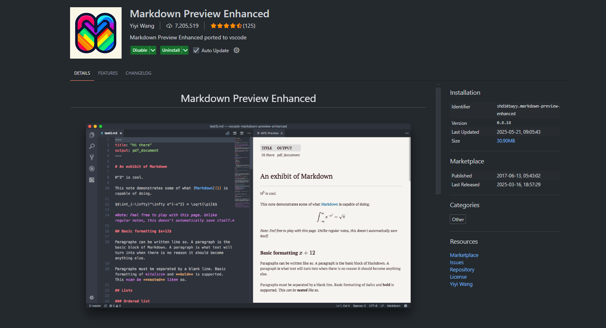
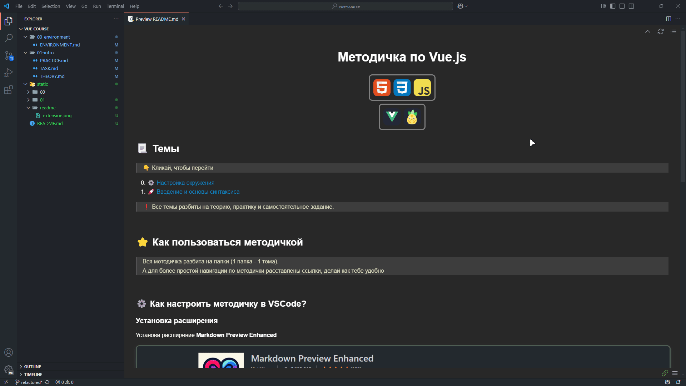

<h1 id=top align=center> Методичка по Vue.js </h1>

 
  
  

  

## 📃 Темы
> 👇 Кликай, чтобы перейти

0. [⚙️ Настройка окружения](./00-environment/ENVIRONMENT.md)
1. [🚀 Введение и основы синтаксиса](./01-intro/THEORY.md)
2. [🎨 Директивы Vue](./02-directives-binding/THEORY.md)
3. [🕵️ Условный рендеринг](./03-conditional-lists/THEORY.md)
4. [🖱️ Обработка событий](./04-event-handling/THEORY.md)
5. [📝 Двустороннее связывание данных](./05-form-binding/THEORY.md)
6. [👀 Вычисляемые свойства и Наблюдатели](./06-computed-watchers/THEORY.md)
7. [🧩 Компоненты: Основа](./07-components-basics/THEORY.md)
8. [🧩 Компоненты: События, Слоты и Динамические компоненты](./08-components-advanced/THEORY.md)
9. [🗺️ Введение в Vue Router](./09-vue-router-basics/THEORY.md)
10. [🛣️ Vue Router: Динамические маршруты и Параметры](./10-vue-router-dynamic/THEORY.md)
11. [🗃️ Управление состоянием: Pinia](./11-state-management-pinia/THEORY.md)
12. [🌐 Взаимодействие с API](./12-api-data-fetching/THEORY.md)
13. [🚀 Сборка проекта и основы развертывания](./13-build-deployment/THEORY.md)

> ❗ Все темы разбиты на теорию, практику и самостоятельное задание.

 

## ⭐ Как пользоваться методичкой

> Вся методичка разбита на папки (1 папка - 1 тема).
> А для более простой навигации по методички расставлены ссылки, делай как тебе удобно

 

### ⚙️ Как настроить методичку в VSCode?

#### 1. Установка расширения
Установи расширение **Markdown Preview Enhanced**

 

#### 2. Откритие файлов
Чтобы открыть файлы следуй гифке 👇

 

#### 3. Настройка расширения
Настрой расширение под свои хотелки

 

---

 

**[⬆️ Наверх](#top)** 

